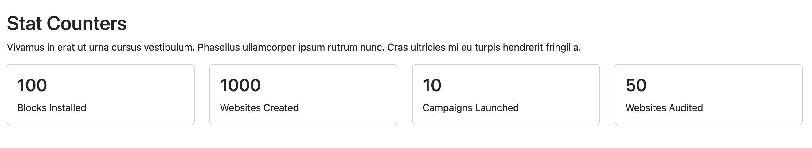

# Silvertripe Elemental Stat Counters

Statistic counters block for Silverstripe Elemental


[](https://github.com/sponsors/dynamic)

[](https://packagist.org/packages/dynamic/silverstripe-elemental-stat-counters)
[](https://packagist.org/packages/dynamic/silverstripe-elemental-stat-counters)
[](https://packagist.org/packages/dynamic/silverstripe-elemental-stat-counters)


## Requirements

* Silverstripe ^6
* Silverstripe Elemental ^6
* PHP ^8.3

## Installation

```
composer require dynamic/silverstripe-elemental-stat-counters
```

## License
See [License](license.md)

## Features

* Display animated statistics counters in Elemental content areas
* Multiple statistics displayed in a responsive row layout
* Count-up animation from 0 to entered number
* Bootstrap-based default styling
* Customizable counter text and values
* Supports any numeric value format
* Mobile-responsive design

## Usage

Displays multiple statistics in a row. Stats will animate upwards from 0 until they hit the entered number.

## Upgrading from version 3.x

SilverStripe Elemental Stat Counters 4.0 is compatible with SilverStripe 6. Key changes:

- Updated to SilverStripe CMS 6
- Requires PHP 8.3 or higher
- Requires Elemental 6 (`dnadesign/silverstripe-elemental: ^6` - previously `^5.0`)
- Updated dependencies to SS6 compatible versions
- No API changes - maintains full backward compatibility with 3.x

## Screen Shots

#### Default Bootstrap template with animated count-up


## Getting more elements

See [Elemental modules by Dynamic](https://github.com/orgs/dynamic/repositories?q=elemental&type=all&language=&sort=)

## Configuration

See [SilverStripe Elemental Configuration](https://github.com/dnadesign/silverstripe-elemental#configuration)

## Maintainers
 *  [Dynamic](https://www.dynamicagency.com) (<dev@dynamicagency.com>)

## Bugtracker
Bugs are tracked in the issues section of this repository. Before submitting an issue please read over
existing issues to ensure yours is unique.

If the issue does look like a new bug:

 - Create a new issue
 - Describe the steps required to reproduce your issue, and the expected outcome. Unit tests, screenshots
 and screencasts can help here.
 - Describe your environment as detailed as possible: SilverStripe version, Browser, PHP version,
 Operating System, any installed SilverStripe modules.

Please report security issues to the module maintainers directly. Please don't file security issues in the bugtracker.

## Development and contribution
If you would like to make contributions to the module please ensure you raise a pull request and discuss with the module maintainers.
